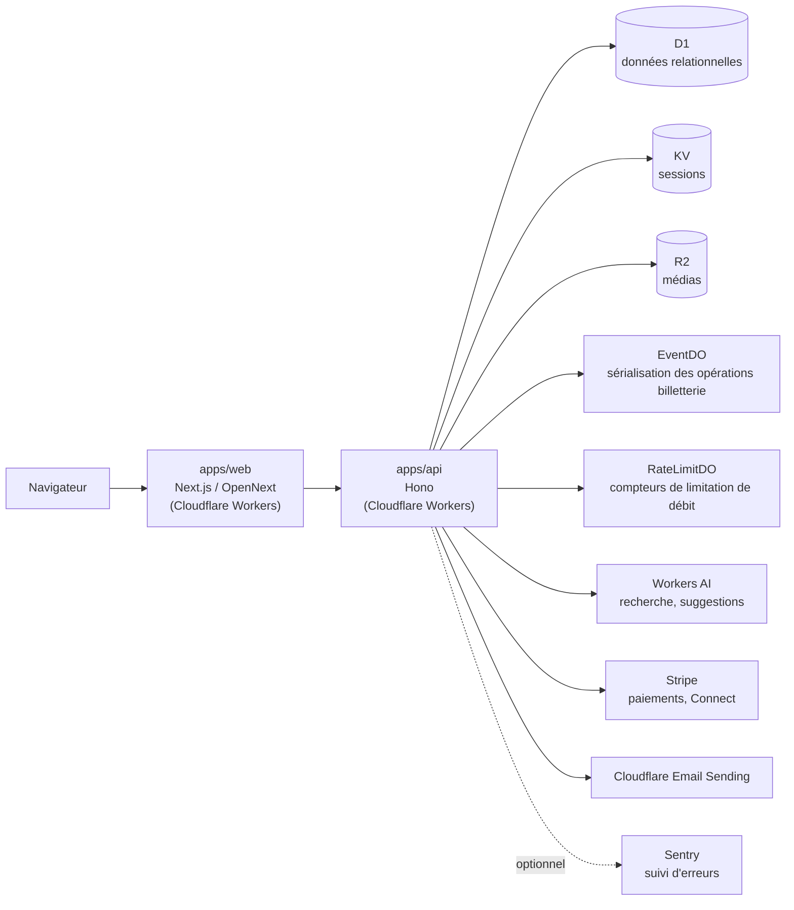

# EventGalo

Monorepo pnpm/turbo pour la billetterie EventGalo.

## Structure

- `apps/api` — API [Hono](https://hono.dev/) sur Cloudflare Workers (D1, KV, R2, Durable Objects)
- `apps/web` — App [Next.js 15](https://nextjs.org/) déployée sur Cloudflare via [OpenNext](https://opennext.js.org/cloudflare)
- `packages/shared` — Types et utilitaires partagés

## Architecture



`apps/web` sert le rendu (statique et SSR) et appelle `apps/api` côté client pour toutes les opérations dynamiques (auth, billetterie, sponsoring…). `apps/api` centralise l'accès aux données et aux services tiers.

### Cohérence de la billetterie

Le Durable Object `EventDO` sérialise les opérations qui touchent aux compteurs de billets. **Attention à ne pas se reposer sur sa seule existence** : `EventDO` ne stocke rien localement, tout son état vit dans D1. L'*input gating* qui sérialise naturellement les requêtes d'un DO ne couvre que les `await` sur le stockage du DO lui-même — sur un `await` vers D1, une seconde requête entre et s'entrelace. La cohérence repose donc sur trois couches, et il faut les trois :

1. `blockConcurrencyWhile` autour de chaque opération mutante (`src/do/event-do.ts`). Le refus métier y est renvoyé **comme valeur, jamais comme exception** : une exception qui traverse `blockConcurrencyWhile` fait détruire et redémarrer le Durable Object.
2. Des écritures conditionnelles (`WHERE … AND status = 'pending'`, `WHERE sold + ? <= quantity`) dont on vérifie `meta.changes`. Seul garde-fou qui survit à une migration ou un redémarrage du DO, où deux instances peuvent coexister brièvement.
3. Les contraintes `CHECK (sold >= 0 AND sold <= quantity)` de la base, dernier filet.

Deux tâches planifiées complètent le dispositif : le balayage horaire des réservations restées `pending` plus de 45 minutes (`releaseStalePendingTransactions`) libère les places retenues par un panier abandonné dont le webhook Stripe `checkout.session.expired` ne serait jamais arrivé.

## Prérequis

- Node.js
- pnpm (`packageManager` défini dans `package.json`)
- Un compte Cloudflare avec Wrangler authentifié (`wrangler login`)

## Installation

```bash
pnpm install
```

## Développement

```bash
pnpm dev
```

Lance `apps/api` et `apps/web` en parallèle via Turbo. `wrangler dev` (utilisé par `apps/api`) émule D1, KV et R2 **localement** par défaut (stockage SQLite/miniflare, aucune configuration supplémentaire) — pas besoin de ressources Cloudflare réelles pour développer. Avant le tout premier `pnpm dev`, initialiser le schéma local :

```bash
pnpm db:migrate:local
```

Pour pointer `apps/api` vers les ressources Cloudflare réelles plutôt que l'émulation locale (rare, cas avancé) : `wrangler dev --remote`.

## Déploiement

```bash
pnpm deploy
```

Déploie `apps/api` et `apps/web` via Turbo. Chaque app peut aussi être déployée individuellement :

```bash
pnpm --filter @eventgalo/api deploy
pnpm --filter @eventgalo/web deploy
```

### Variables d'environnement

**`apps/api`** — secrets à poser via `wrangler secret put <NOM>` (staging et production, séparément) :

| Variable | Rôle |
| --- | --- |
| `TICKET_SIGNING_KEY` | Signature HMAC des QR codes de billets (obligatoire) |
| `STRIPE_SECRET_KEY` | Clé API Stripe. Sans elle, les paiements sont désactivés (billets gratuits uniquement) |
| `STRIPE_WEBHOOK_SECRET` | Vérifie la signature du webhook Stripe principal (paiements) |
| `STRIPE_CONNECT_WEBHOOK_SECRET` | Vérifie la signature du webhook des comptes connectés Stripe (`account.updated`) |
| `TURNSTILE_SECRET_KEY` | Vérification serveur de Cloudflare Turnstile — protège la demande de lien magique contre l'abus automatisé. **Obligatoire en production** : sans elle, la vérification échoue au lieu d'être ignorée en silence |
| `SENTRY_DSN` | Optionnel — désactive le suivi d'erreurs si absent |
| `PLATFORM_FEE_PERCENT` / `PLATFORM_FEE_FIXED_CENTS` | Optionnels — frais de service par billet (défaut : 5 % + 99 ¢ si non définis) |

L'envoi d'email passe par le binding Cloudflare Email Sending (`EMAIL`, déclaré dans `wrangler.jsonc`) ; `EMAIL_FROM`, `WEB_BASE_URL`, `API_BASE_URL` et `ENVIRONMENT` y sont déjà configurés par environnement (`vars`, committés) — ce ne sont pas des secrets à poser séparément. Sans `EMAIL_FROM`, les emails ne sont pas envoyés (liens magiques exposés via `debug_url`).

**`apps/web`** — variables publiques (`NEXT_PUBLIC_*`, exposées au navigateur), définies dans `.github/workflows/deploy.yml` par environnement, pas de secret côté client :

| Variable | Rôle |
| --- | --- |
| `NEXT_PUBLIC_API_URL` | URL de base de l'API appelée depuis le navigateur |
| `NEXT_PUBLIC_TURNSTILE_SITE_KEY` | Clé publique du widget Cloudflare Turnstile (contrepartie de `TURNSTILE_SECRET_KEY` côté API) |

## Migrations base de données

```bash
pnpm db:migrate:local
pnpm db:migrate:remote
```

## Internationalisation

`apps/web` utilise [next-intl](https://next-intl.dev/) en mode **sans routing par locale** : pas de préfixe d'URL (`/fr/...`, `/en/...`), pas de middleware, une locale statique (`fr`) renvoyée par `apps/web/i18n/request.ts`. Ce choix est délibéré :

- Aucun contenu anglais n'existe à ce jour — préfixer 35 routes (dont plusieurs à segments dynamiques : `[id]`, `[slug]`, `[token]`, `[code]`, `[serial]`) sous un dossier `[locale]` serait un chantier lourd sans bénéfice immédiat.
- Des URLs déjà indexées/partagées (ex. `/e/<slug>`) changeraient de forme pour rien.

Le jour où une seconde langue est réellement ajoutée, next-intl permet d'évoluer vers un routing par locale ou une bascule par cookie sans repartir de zéro.

**État de la migration** : `apps/web/messages/fr.json` est la source de vérité pour tout texte migré. À ce stade, seuls `app/page.tsx` (page d'accueil) et `components/topbar-nav.tsx` (barre de navigation) sont migrés — le reste de l'app (~34 pages, ~27 composants) affiche encore du texte français en dur, à migrer au même patron au fil de l'eau :

- Texte simple → `useTranslations("Namespace")` puis `t("clé")`.
- Listes de contenu structuré sans élément non sérialisable (FAQ, témoignages) → `t.raw("clé")` pour récupérer le tableau tel quel.
- Listes associées à des éléments non sérialisables (icônes de composant) → garder le tableau côté code avec une clé de traduction par élément, et résoudre le texte via `t(`namespace.${clé}.champ`)`.

Restent volontairement non traitées : les métadonnées SEO de `app/layout.tsx` (title/description/keywords/OG), qui resteraient statiques (les rendre dynamiques demanderait de passer `export const metadata` en `generateMetadata` async — un changement plus structurant que le reste de cette migration).
